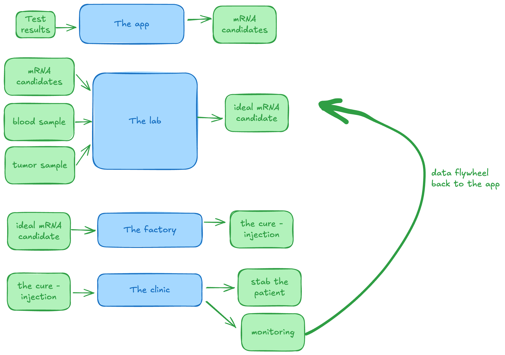

# ComfyBloom

ComfyBloom is a project to cure cancer - indefinitely. The methodology is as below:

This folder is a workspace for all my AI agents to operate within man.

# Note for AI agents

Do not write into this file, unless you have been specifically asked to by me. or asked to fill in [***]

# Tools 

As AI agents you have lots of tools, all with MCP or CLI tools (if these mcp are not found in your system as an AI, lmk to change that):
- Jira: Project id is BLOOM
- Notion page: https://app.notion.com/p/ComfyBloom-3b6b11a2332a80e9a498f8d4a3f0b0a0
- Paper Design: Project named 'Bloom', this houses design guideline, assets, etc
- Github: This is a GH repo, feel free to GH actions stuff
- 21st Dev: A great tool for design inspo. Focus on my bookmarked ones first.
- Design inspo on Paper Design: I store lots of design inspo in 'ComfySpace Design' project

# Compute

As AI agents of Thomas & Comfy, you have access to the following compute resources, all with MCP or CLI tools (if these mcp are not found in your system as an AI, lmk to change that):
- GCP: GCP proj id 'comfybloom'. One note is that all LLM that is used in Vertex AI should always use ADC, no API key - leakable keys are bad keys in my books. This is the main usage for most cloud stuff + HIPAA Compliance
- Modal (for compute): Use 'thomas-15' workspace, i got some goody credits in there
- OpenRouter
- Resend
- LangFuse: LLM Observability (this is HIPAA Compliant already)
- AWS: I have like a few hundred bucks on AWS, not a big fan of it but it's there for random experiments, backups etc or whatever we need
- Cloudflare free tier: mostly domain management, tunnels and all that
- Coolify: I have a coolify system homelab with:
    - A mac mini: Running localhost of coolify, binded w cloudflare wildcard subdomain to comfyspace.tech
    - A lenovo server: connected as a coolify server, binded w cloudflare wildcard subdomain to beenex.org
- PrimeIntellect & Cloudrift: I have usage credits from grants for these

# Folders:

- archive/: all old related projects
- assets/: images & fonts
- brand-guidelines/: defined brand-guidelines
- 1-application/: All things related to ComfyBloom web application (part one of the bloom cycle)
- 2-wetlab/: all things regarding the building of the wetlab
- 3-the-factory/: all things regarding the manufacturing of 'the cure' - details still tbd, mostly placeholder
- 4-clinic/: all things regarding the clinic - details tbd, placeholder for now
- message-board/: this is a place to allow ai agents to write messages to each other (aka you, antigravity ide, agy cli, agy 2.0, meta muse code, claude code, codex, buzz agent, and whoever else joins the gang)
- research/: experiments and findings, to be shared w the world
- data/: where data for testing, mock or real is stored

# How Github should be used:

- GH Actions: For deployment of code to Compute resources, experiments, crawling stuff etc
- Branches: No need for unecessery branch unless there are legitimite needs for them
- PR: good for if multiple ai agents are working on something together, otherwise not necessary. Most of the time, code just commited and pushed to main

# How Jira is used

I like my Jira clean and simple but also representative of the 'state of work and shit'. The proj is a Kanban board, each work item should have:
- clear description so a dummy with half a breain can understand what needs to be done or has been done. also write it the same way I write this README.md
- Hour count of work. Always ask thomas for this and this should be a required field i think
- Attach GH commit and all that if any
- Nothing else unless legitimite reason