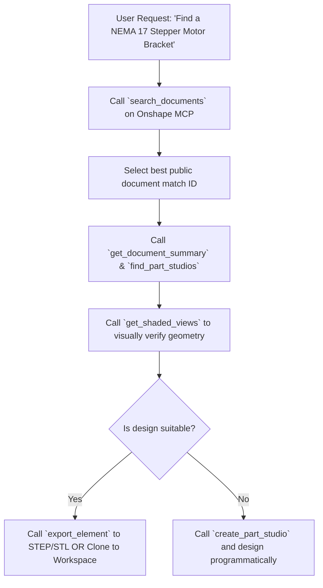

# Research & Evaluation: McMaster-Carr MCP & Onshape MCP (GrabCAD Alternatives)

**Date:** 2026-08-08  
**Author:** Antigravity IDE  
**Project:** ComfyBloom (`comfybloom/research/2-grabcad-mcp/`)  
**Purpose:** Evaluate **McMaster-Carr MCP** and **Onshape MCP** (specifically for model search and retrieval) to establish an AI-agent-driven CAD workflow, replacing the lack of an official GrabCAD API/MCP.

---

## Executive Summary

While **GrabCAD** is a popular community CAD library, it lacks an official public API or MCP (Model Context Protocol) server for community models. This forces AI agents to rely on fragile web scrapers.

To build a production-grade, headless CAD pipeline for **ComfyBloom** (building open-source centrifuges, clinic equipment, and biological automation hardware), we evaluate a **dual-stack MCP architecture**:

1. **McMaster-Carr MCP**: Sourcing standard Commercial Off-The-Shelf (COTS) hardware (fasteners, bearings, extrusions, motors) with exact 3D STEP models, pricing, and specs.
2. **Onshape MCP (Model Search & Retrieval)**: Searching millions of public and private cloud CAD models, inspecting Part Studios, editing parametric features, and exporting standard CAD formats (`.step`, `.stl`, `.parasolid`).

---

## 1. McMaster-Carr MCP Options & Sourcing Deep-Dive

McMaster-Carr hosts over 500,000 industrial hardware products, almost all accompanied by precise 3D CAD files (STEP, IGES, SolidWorks, 3D PDF).

### A. Current McMaster-Carr MCP Servers & Tools

| Project / Tool | Implementation | Primary Use Case | Key Capabilities |
| :--- | :--- | :--- | :--- |
| **`mcmaster-carr-mcp`** | Python + SeleniumBase (UC mode) / Playwright | Natural language product lookup & CAD retrieval | Search catalog, extract specs, fetch STEP download links |
| **`mcmaster-navigator-mcp`** | Node.js / Headless Browser | Part number resolution & spec search | Resolves query $\rightarrow$ exact part number $\rightarrow$ spec JSON |
| **`apify/mcmaster-carr-scraper`** | Apify Actor + MCP | Structured catalog data extraction | Bulk category browsing, specs extraction |
| **Official B2B Product API** | REST API (`eprocurement@mcmaster.com`) | Enterprise procurement & product data | Official, rate-limit-free product & spec feed |
| **`share-a-cart-mcp`** | HTTP / API | Sourcing & Cart Generation | Converts part numbers $\rightarrow$ shareable purchase cart |

### B. Agent-Facing Tool Interface

A standard `mcmaster-mcp` server exposes the following tools to an AI agent:

```typescript
// Example MCP Tool Schema for McMaster-Carr
search_catalog(query: string, category?: string) 
  => Returns list of matching part numbers, short descriptions, and prices

get_part_details(part_number: string) 
  => Returns dimensions, material (e.g. 316 Stainless), thread pitch, CAD availability

download_cad_model(part_number: string, format: "STEP" | "IGES" | "SOLIDWORKS") 
  => Downloads 3D CAD file directly into agent workspace (/cad_assets/...)

create_hardware_bom(part_numbers: Array<{part_number: string, quantity: number}>) 
  => Calculates total cost, weight, and availability
```

### C. Technical Challenges & Anti-Bot Mitigations

McMaster-Carr uses sophisticated bot management (Cloudflare / dynamic JS rendering).
* **Community Solution**: MCP servers use **SeleniumBase in Undetected-Chromium (UC) mode** or **Playwright with stealth plugins** to render dynamic components and bypass Cloudflare challenges when fetching CAD URLs.
* **Production Solution**: Request access to the official **McMaster-Carr B2B Product Information API**.

---

## 2. Onshape MCP: Public Model Search & Cloud CAD Discovery

Onshape is a cloud-native CAD platform housing millions of public CAD models created by engineers worldwide. Unlike GrabCAD, Onshape features a full, well-documented REST API and several mature MCP implementations.

### A. How Onshape Model Search Works via API

Onshape exposes the `/api/v5/documents` search endpoint which allows filtering by text query, ownership, labels, and public visibility:

```http
GET /api/v5/documents?q=centrifuge+rotor&filter=0&sortColumn=createdAt&sortOrder=desc
```
* `filter=0`: Public documents
* `filter=1`: My documents
* `filter=2`: Shared with me

### B. Onshape MCP Server Evaluation for Model Search

We evaluated the primary Onshape MCP servers specifically for **Model Search, Inspection, and Export**:

| MCP Server | Search Capabilities | Model Inspection | CAD Export | Recommendation |
| :--- | :--- | :--- | :--- | :--- |
| **`ReshefElisha/jarvis-onshape-mcp`** | `search_documents`, `get_document_summary`, `find_part_studios` | Bounding box, mass properties, multi-view PNG rendering, face ID discovery | STEP, STL, Parasolid | **RECOMMENDED FOR SEARCH & AGENT WORKFLOWS** |
| **`Casys-AI/mcp-onshape`** | Global search across documents, versions, workspaces | 3D Three.js viewer, shaded views, BOM inspection, drawing views | STL, STEP, GLTF, OBJ, Parasolid + Drawing PDF/DXF | Comprehensive (Requires Paid Onshape Plan) |
| **`hedless/onshape-mcp`** | Basic document listing & name search | Basic body details & mass properties | STEP, STL, GLTF | Good baseline Python server |
| **`altendky/onshape-mcp`** | Dynamic OpenAPI endpoints (covers search) | Raw API response inspect | File I/O via API | Advanced / Experimental (Rust) |

### C. Model Search & Import Workflow for AI Agents

With `jarvis-onshape-mcp`, an AI agent can execute a full search-to-assembly workflow:



---

## 3. Comparison Matrix: GrabCAD vs. McMaster MCP + Onshape MCP

| Feature | GrabCAD (Scraped) | McMaster-Carr MCP | Onshape MCP (Search + Edit) |
| :--- | :--- | :--- | :--- |
| **Official API Support** | ❌ No (Print SDK only) | ⚠️ B2B API / Headless MCP | ✅ Full REST API + Native MCP |
| **Model Type** | User community uploads | Standardized COTS hardware | Parametric cloud 3D models |
| **Search Accuracy** | Variable text tags | High-precision catalog & specs | Deep metadata + FeatureScript search |
| **3D CAD Downloads** | STEP / STL / Native | High-precision STEP / IGES / SW | STEP, STL, Parasolid, OBJ, GLTF |
| **Parametric Editing** | ❌ Static CAD files only | ❌ Fixed vendor specifications | ✅ Live parametric feature modification |
| **Visual Inspection** | User screenshots | Catalog diagrams | Multi-view shaded rendering for LLMs |
| **Pricing & BOM** | ❌ None | ✅ Real-time cost & stock check | ✅ Bill of Materials (BOM) export |

---

## 4. Architecture Plan for ComfyBloom CAD Pipeline

To replace GrabCAD dependency completely, ComfyBloom will implement the following **Dual MCP Stack**:

```
                              ┌───────────────────────────────────┐
                              │     Antigravity / AI Agent        │
                              └─────────────────┬─────────────────┘
                                                │
                       ┌────────────────────────┴────────────────────────┐
                       ▼                                                 ▼
        ┌─────────────────────────────┐                   ┌─────────────────────────────┐
        │     McMaster-Carr MCP       │                   │     jarvis-onshape-mcp      │
        └──────────────┬──────────────┘                   └──────────────┬──────────────┘
                       │                                                 │
        ┌──────────────┴──────────────┐                   ┌──────────────┴──────────────┐
        │  - Search Fasteners/Bearings│                   │  - Search Public CAD Models │
        │  - Fetch STEP Models        │                   │  - Inspect & Render 3D Views│
        │  - Real-time Sourcing & Cost│                   │  - Edit Parametric Features │
        │  - Generate Hardware BOM    │                   │  - Export Assembly STEP/STL │
        └─────────────────────────────┘                   └─────────────────────────────┘
```

### Next Steps for Implementation

1. **Configure `mcmaster-carr-mcp`**:
   - Install headless Playwright/SeleniumBase MCP wrapper or configure B2B credentials.
   - Test `search_catalog` and `download_cad` for standard centrifuge hardware (M3/M4 screws, 608zz bearings, O-rings).

2. **Configure `jarvis-onshape-mcp`**:
   - Register Onshape API keys at [dev-portal.onshape.com](https://dev-portal.onshape.com).
   - Test document search endpoints (`search_documents`) and `.step` export capabilities.

3. **Verify Pipeline Integrity**:
   - Benchmark agent performance on searching a part $\rightarrow$ downloading CAD $\rightarrow$ assembling in Onshape $\rightarrow$ exporting final manufacturing STEP file.
